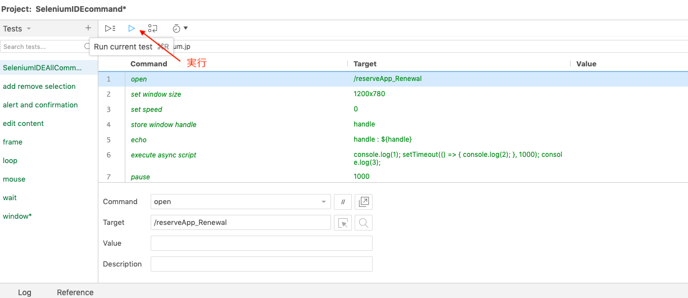

# SeleniumIDE Demo

[](https://travis-ci.org/RustyNail/SeleniumIDEDemo)

これからSeleniumを使ったテスト自動化を初められる方、簡単にデモで体験をして見たい方向けにサンプルを作成しました。

Selenium IDE の使い方については以下のQiita記事を参照してください。

https://qiita.com/oh_rusty_nail/items/5b584c95e01759c00869

作成したテストは日本Seleniumユーザーコミュニティが提供している[デモサイト](http://example.selenium.jp/reserveApp_Renewal/) を対象サイトとしています。

用途別に2つのテストプロジェクトを用意しています。

* STARHOTEL_reservation.side
    * こちらは対象サイトを開いてタイトル検証をする程度のシンプルなテストです
    * これからテストを追加したりする演習を行う際のベースにお使いください
* SeleniumIDECommands.side
    * SeleniumIDE(バージョン v3.12.0)で利用可能なコマンドを可能な限り全て使ったサンプルです
    * SeleniumIDEで実行する際は、SeleniumIDEを起動して、「Open an existing project」からSeleniumIDECommands.sideを選択してください
    * テストは下記手順で実行できます
    * 

また、STARHOTEL_reservation.sideのテストをTravisCIで実行できるように設定した .travis.ymlを配置しています。

ローカル環境でコマンドライン上で実行する場合は、以下の手順で実施してください。

```
$ npm install -g selenium-side-runner
$ npm install -g chromedriver
$ selenium-side-runner -c "browserName=chrome" STARHOTEL_reservation.side 
```